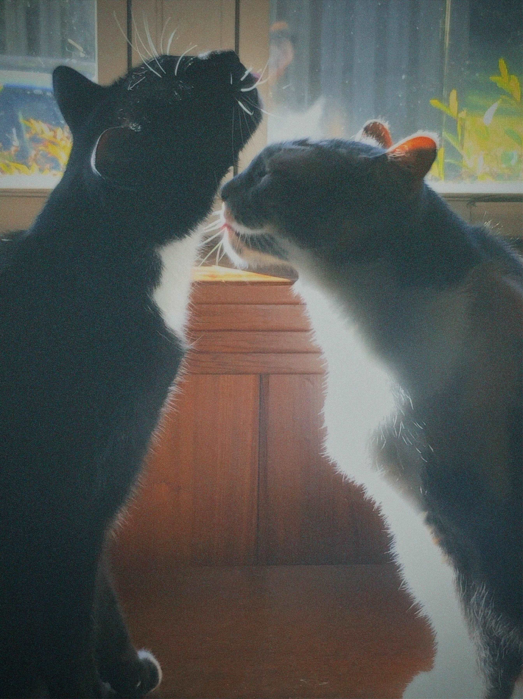

# hey, I'm Riley 👋
 
Master's student in Computer Science (Data Science focus), I like finding the story in the data and making sure it's actually understood by the people who need it.
 
I'm exploring roles across the data space: **data analyst**, **BI analyst**, **analytics engineer**, **data engineer**, **product analytics**, **insights analytics** and **marketing analytics**. I care about craft, clarity, and usability.
 
---
 
## what I work with
 
```python
skills = {
    "languages":        ["Python", "SQL"],
    "tools & workflow":    ["Excel", "Power BI", "Tableau", "dbt", "Jupyter", "Git"],
    "databases":        ["[e.g. PostgreSQL, BigQuery, Snowflake]"],
}
```
 
---
 
## a bit more about me
 
I come from a computer science background, so picking up new tools and technical systems has always felt natural to me. What interests me most, though, is using data to better understand problems and make clearer decisions.

I've always learned by breaking concepts down into examples and patterns that make sense to me, and that's shaped the way I think about analytics too. Good dashboards and reporting should help people understand something quickly, not overwhelm them with information.
 
---
 
## projects
 
> *(coming soon — check back or reach out if you're curious)*
 
---
 
## currently
 
- 📚 finishing my M.S. in CS with a data science focus
- 🔍 open to full-time analyst and data roles (2025)
- 🛠 building out this portfolio — watch this space
---
 
## let's connect
 
[](https://www.linkedin.com/in/riley-olney-23626725a/)
[](mailto:rileyolney44@gmail.com)
 
---

and finally, my cats:



---
 
<sub>always learning. always improving.</sub>

<!--
**rileyyo/rileyyo** is a ✨ _special_ ✨ repository because its `README.md` (this file) appears on your GitHub profile.

Here are some ideas to get you started:

- 🔭 I’m currently working on ...
- 🌱 I’m currently learning ...
- 👯 I’m looking to collaborate on ...
- 🤔 I’m looking for help with ...
- 💬 Ask me about ...
- 📫 How to reach me: ...
- 😄 Pronouns: ...
- ⚡ Fun fact: ...
-->
